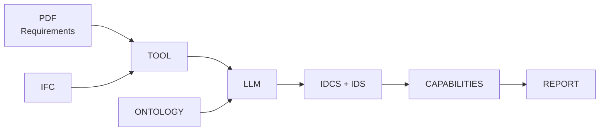
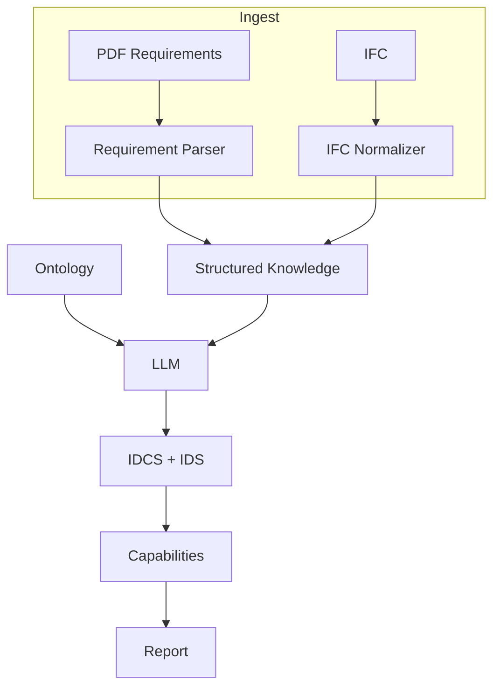

# InfoBIM — Ontology → IDS/Capabilities → Report

This project implements a workflow that integrates requirements (PDF), IFC models, and ontologies to produce verifiable rules (IDS/IDCS), run capabilities, and generate reports.

## Overview

The diagram below presents the workflow and shows the main stages and deliverables:



- Inputs: specification documents (PDF) and IFC models
- Tool: normalizes, extracts, and structures data for the LLM
- LLM: uses the ontology to transform requirements into formal artifacts
- Intermediate outputs: IDS/IDCS for validations and rules
- Execution: capabilities consume IDS/IDCS and produce reports

## Detailed Flow



## Main Components

- Ontology and rules:
  - `shared/ontologies/` holds core and rule ontologies (Turtle)
- Capabilities:
  - ICDD/IFC conversion: normalizes IFC and applies mappings
  - TTL → IDS: extracts IDS-expressible rules from ontology and generates IDS
- IDS/IDCS:
  - Examples in `shared/ids/`

## How to Run

Assuming the virtual environment is configured:

1) Build example ICDD container

```bash
bash make_icdd.sh
```

2) Normalize IFC and apply mappings from ICDD

```bash
.venv/bin/infobim run \
  --id org.local.domain.icdd.capability.ontology.convert \
  --icdd-path shared/icdd/fnde/pack/ICDD-FNDE-Space.icdd \
  --ifc-path shared/IFC_files/TIPO1-ARQ-MOD_R03.ifc
```

Result: `shared/IFC_files/TIPO1-ARQ-MOD_R03.norm.ifc`

3) Transform TTL ontologies into IDS

```bash
.venv/bin/infobim run \
  --id org.local.domain.ids.capability.ttl.to_ids \
  --onto-path shared/ontologies/fela-nbr-rules.ttl \
  --ids-output-path /tmp/feso.ids
```

4) Validate IDS (optional, via ifctester)

```bash
.venv/bin/python - <<'PY'
from ifctester import ids
x = ids.open('/tmp/feso.ids', validate=True)
print('spec_count', len(x.specifications))
PY
```

## Relevant Structure

- `shared/capability/package/capability/plugin/capability/convert_icdd_ontology.py`
  - Normalizes IFC and applies rules/mappings (ICDD → IFC)
- `shared/capability/package/capability/plugin/capability/ttl_to_ids.py`
  - Reads Turtle (RDFLib), filters IDS-expressible rules, and generates specifications
- `shared/tests/test_ttl_to_ids_read_fela_computable_rules.py`
  - Unit tests (pytest) for the TTL rule extractor only

## Notes

- The TTL parser uses RDFLib and avoids namespace coupling by matching predicates with localname `isExpressibleInIDS` (fallback `isComputableByIDS`).
- IDS is generated via `ifctester.ids` (`Ids.to_xml(...)`).
