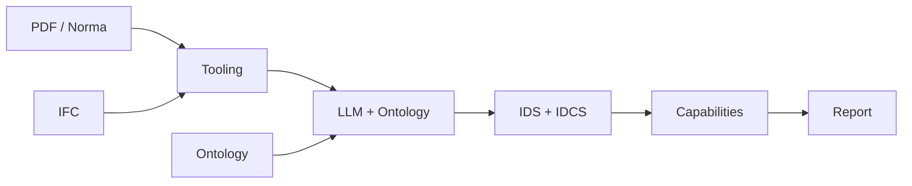

# FFEELLAA / InfoBIM — Validação BIM Automatizada (IDS + IDCS)

## 1) Abertura (10–15s)
- O que fizemos: uma POC que pega uma **norma em PDF** + um **IFC** e entrega **validação executável e explicável**.
- A virada: usar **LLM + ontologia** para sair do texto não-estruturado e gerar dois artefatos formais:
  - **IDS** (o que é expressível)
  - **IDCS** (o que não é expressível em IDS, mas existe na norma)

## 2) O desafio real (30–45s)
- Aqui todo mundo conhece openBIM. O diferencial não é “validar IFC”.
- O gargalo é: **a norma está em PDF**, cheia de linguagem natural, casos e exceções.
- Traduzir isso para regras executáveis é onde o custo explode e onde projetos perdem rastreabilidade.
- Nossa POC fecha o ciclo:
  - **PDF → regra formal → execução no IFC → evidência**

## 3) O que entregamos (30–45s)
- Entradas:
  - Norma/guia em PDF (ex.: NBR 15808)
  - IFC
  - Ontologia (vocabulário + regras) e/ou ICDD (dicionário/mapeamentos), quando aplicável
- Saídas:
  - **IDS**: presença de propriedades, tipos, allowed values, padrões
  - **IDCS**: constraints matemáticas e cross-property (fora do escopo do IDS)
  - **Validação automatizada**:
    - IDS via ifctester
    - IDCS via SymPy + IfcOpenShell
  - **Relatório explicável** com:
    - ID (GlobalId) do elemento
    - regra aplicada
    - expressão completa
    - valores usados e “missing” (memória de cálculo)

## 4) Por que isso merece ganhar (45–60s)
- **Resolve o “trabalho sujo”**: levar norma em PDF para validação executável, sem depender de interpretação manual.
- **Escala e governança**: regras versionáveis, reusáveis, auditáveis e comparáveis entre projetos.
- **Explicabilidade real**: não é “pass/fail”; é “pass/fail com evidência”.
- **Complementa o IDS**: não tenta forçar o padrão a fazer o que ele não cobre.

## 5) Por que IDCS é essencial (45–60s)
- IDS cobre muito bem “regras atômicas”. Mas norma raramente é atômica.
- Exemplo típico (e do nosso demo):
  - `BurstPressure >= 8 * NominalChargingPressure`
  - e também `BurstPressure >= 5 MPa`
  - condicionado por `PressurisationMode` e `JointType`
- Isso é **cross-property + matemática + contexto**.
- Sem IDCS, você:
  - ignora o requisito mais crítico, ou
  - volta para validação manual (perde auditabilidade)

## 6) Arquitetura do fluxo (1 min)

### Onde entram as peças
- PDF: fonte oficial do requisito (texto não-estruturado)
- LLM + Ontologia: “ponte” que converte texto em estruturas e regras formais (com vocabulário controlado)
- IDS: regras que cabem no padrão e podem ser compartilhadas no ecossistema
- IDCS: regras matemáticas/cross-property que a norma exige, mas o IDS não expressa
- Capabilities: execução e relatório com evidência

## 7) Diferenciais que o jurado vê na hora (60–90s)
- **PDF → regra executável**: o caminho do requisito textual até a validação rodando no IFC.
- **Dois motores, um relatório**:
  - IDS valida “estrutura e domínio”
  - IDCS valida “lógica e matemática”
- **Memória de cálculo** no relatório:
  - expressão completa
  - valores usados por elemento
  - “missing” destacado quando falta dado (qualidade da informação)
- **Pronto para demo**: CLI + relatório colorido, sem depender de leitura de código.

## 8) Demonstração (2–3 min)

### Demo 1 — Normalização / Preparação (opcional, se usar ICDD)
- Entradas: IFC + ICDD (mapeamentos/dicionários)
- Saída: IFC normalizado (`*.norm.ifc`)

### Demo 2 — Gerar IDS a partir da ontologia (TTL → IDS)
- Entrada: ontologia TTL (regras expressíveis)
- Saída: arquivo `.ids`

### Demo 3 — Validar IDS (ifctester)
- Entrada: `.ids` + `.ifc`
- Saída: tabela de specifications, contagens e detalhes com IDs

### Demo 4 — Validar IDCS (SymPy + IfcOpenShell)
- Entrada: `.idcs` + `.ifc`
- Saída: tabela de constraints, status e **detalhes com valores e expressão**

## 9) Momento “uau” (30–45s)
O que você aponta na tela para os jurados:
- A validação IDCS mostra a expressão inteira e os valores do IFC:
  - Regra: `BurstPressure >= 8 * NominalChargingPressure` e `BurstPressure >= 5`
  - Valores do elemento (GlobalId X): `BurstPressure=13.85`, `NominalChargingPressure=2.26`
  - Conta: `8 * 2.26 = 18.08` → falha
- E quando falta dado:
  - `Pset.Prop=missing` em amarelo → ação direta: “completar informação”

## 10) Impacto e próximos passos (45–60s)
- Impacto imediato:
  - Check automático de dados e conformidade antes de obra/compras
  - Padronização do “como validar”
- Próximos passos (pós-hackathon):
  - Exportar relatório em HTML/PDF
  - Ampliar operadores IDCS (unidades com pint, mais funções)
  - Integrar geração de IDCS/IDS diretamente do repositório de regras/ontologia
  - Conectar com pipelines CI (validação contínua de modelos IFC)

## 11) Encerramento (10–15s)
- O que entregamos: uma pipeline que transforma **norma em PDF** em **validação automática e explicável** (IDS + IDCS).
- Por que merece ganhar: resolve o gargalo norma→regra, executa no IFC e entrega evidência auditável com memória de cálculo.
